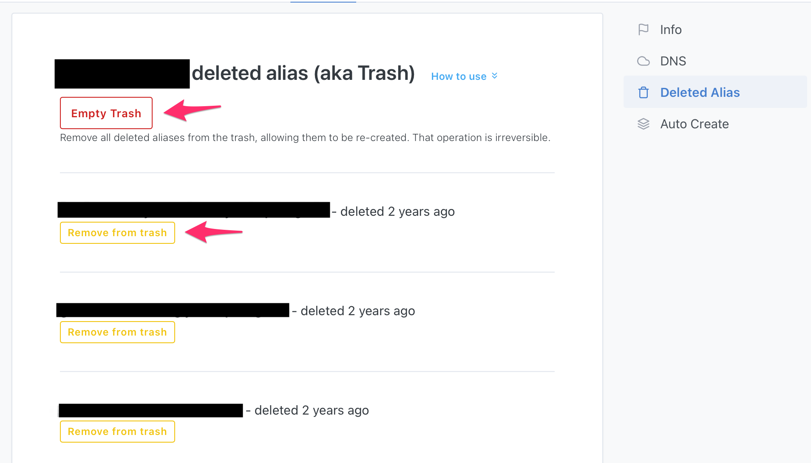

## Delete an alias

We recommend **against** deleting an alias as this operation isn't reversible, meaning a deleted alias **can't be restored**. In fact, to avoid a deleted alias from being reused by another user, a deleted alias is moved to a global "trash" and SimpleLogin make sure no one can reuse a deleted alias. 

Exception is made for aliases created with your domain or subdomain: in this case, you can **recreate** an alias. Please note that this isn't the same as **restoring** an alias as all records like contacts, settings, etc associated with an alias are deleted when the alias is deleted.

Instead of deleting an alias, we suggest either disable the alias or [block some of its senders](block-sender.md).

If you really want to delete an alias, you can click on "More" button, then "Delete" button.

## Recreate a deleted alias

If an alias **belongs to your domain or subdomain**, it's moved to the domain "Trash" when it's deleted. In order to be able to recreate the alias, you first need to move it out of the trash.

First click on "Details" on the [domain](https://app.simplelogin.io/dashboard/custom_domain) page or [subdomain](https://app.simplelogin.io/dashboard/subdomain) page.

Then click on "Deleted Alias" on the right sidebar:

Here you can either remove a specific alias from the trash or empty the trash.

Once removed from the trash, you can recreate the alias, either on the [custom alias page](https://app.simplelogin.io/dashboard/custom_alias) or by using the catch-all option.

